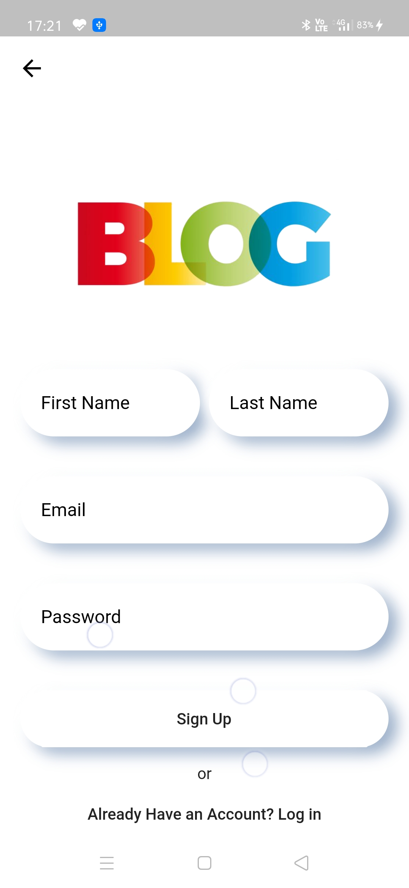
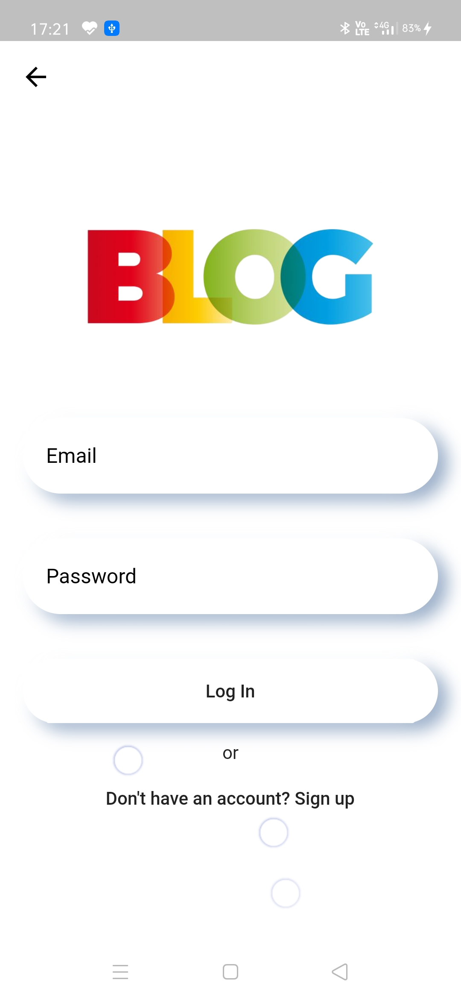
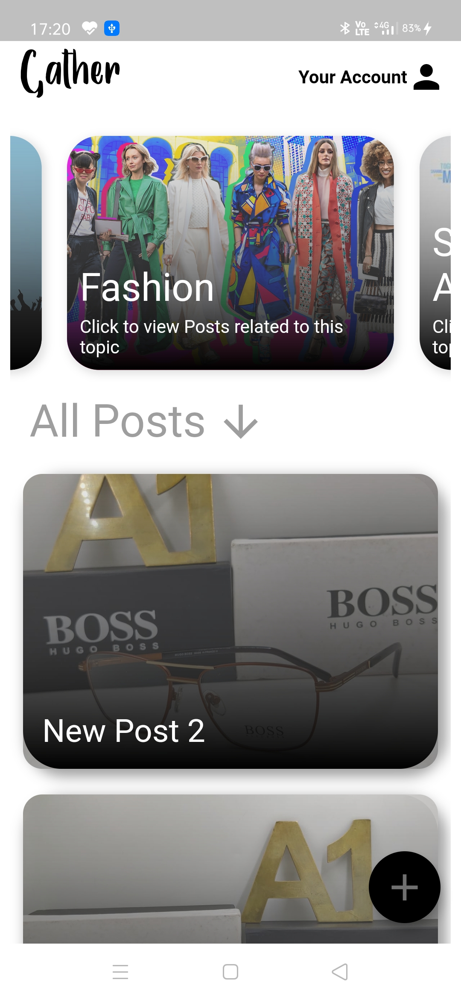
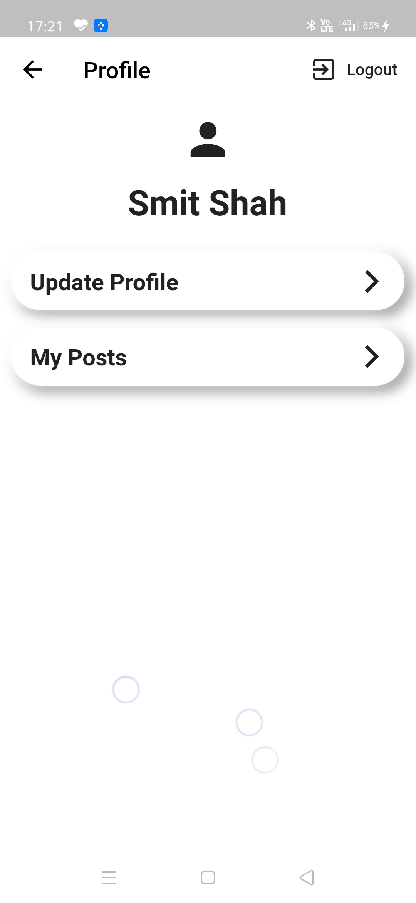

<div align="center">

# Blog App

[](https://flutter.dev/)

[](https://firebase.google.com/)

[](https://code.visualstudio.com/  "Visual Studio Code")

</div>

## Sign Up Page



## Login Page



## Home Page



## Post Page


## Profile Page



## Upload Post Page


#### How To Run 

```html

Download the app-debug.apk file in \build\app\outputs\apk\debug

```

###  Tech stack

`Implemented on` : Visual Studio  <br>

`Language` : Dart<br>

`Framework` : Flutter <br>

`Database and Authentication` : FireBase <br>
